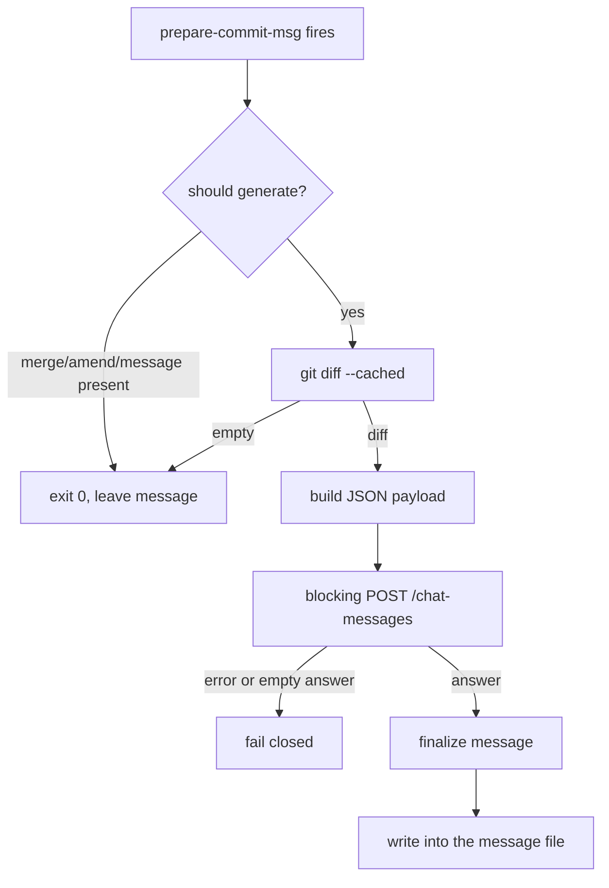

# commit-sense-via-dify CONTEXT

Last updated: 2026-07-24

Descriptive knowledge of what this project is and how it is meant to work. For
behavioral rules and commands, see [AGENTS.md](AGENTS.md).

## Purpose

Generate a Git commit message automatically from the staged changes by
delegating the writing to a Dify application. The project runs during
`git commit`, so the developer commits and receives a coherent message without
composing it by hand.

## Design Status

Nothing is implemented yet. This document records the design settled during
planning so that the implementation and its documentation stay aligned.

| Decision | State |
| --- | --- |
| Dify app, endpoint, and reply mode | confirmed |
| two-script split | confirmed |
| `prepare-commit-msg` as the hook stage | confirmed |
| `bin/` placement | proposed |
| `verify-commit-sense-via-dify.sh` name | proposed |

## Dify Backend

The backend is the **Kaye_Commit_Sense** app, a **Chatflow** (`advanced-chat`
mode), reached through the Dify Service API.

| Item | Value |
| --- | --- |
| Base URL | `http://43.153.9.47/v1` |
| Endpoint | `POST /chat-messages` |
| Authentication | `Authorization: Bearer {API_KEY}` |
| Request | `query` carries the staged diff, `inputs` is `{}`, `user` identifies the author |
| Reply mode | `blocking` — non-streaming, one JSON object |
| Result field | `.answer` |

Blocking mode was chosen deliberately over streaming. The Dify documentation
warns that a blocking request may be cut off after 100 seconds, so the request
carries a timeout and the script fails closed rather than emitting an empty
message.

Configuration arrives through the environment: `DIFY_API_KEY`,
`DIFY_BASE_URL`, and `DIFY_USER`. No credential is stored in the repository.

## Components

Two scripts, kept separate so that credential and connectivity problems are
diagnosed outside the commit path.

| Script | Responsibility |
| --- | --- |
| `commit-sense-via-dify.sh` | generator — staged diff to Dify to commit message |
| `verify-commit-sense-via-dify.sh` | checker — validates configuration, tests the connection |

The checker sources the generator to reuse `resolve_config` and
`check_dependencies`, so the generator's `main` runs only when the file is
executed directly, never when sourced. The checker confirms dependencies and
configuration, calls `GET /info`, and verifies the reported mode is
`advanced-chat`. It is a manual preflight tool, not a hook entry.

## Data Flow

Feedback during the blocking call is a spinner drawn on `stderr`, so the
message file stays the sole product of the run.

## Hook Stage

`prepare-commit-msg` is the correct stage, by Git's own design — it fires after
the default message is prepared and before the editor opens, and it is the only
stage that both receives the message file and still allows the developer to
review the result.

- `pre-commit` receives no arguments, so there is no message file to write
- `commit-msg` fires after the developer has edited, so writing there destroys their text
- `post-commit` would require rewriting the commit

Two consequences shape the script. `git commit --no-verify` bypasses
`pre-commit` and `commit-msg` but **not** `prepare-commit-msg`, so the generator
needs its own opt-out through an environment variable. The `$2` source argument
must be checked so that `-m`, merges, squashes, and amends are never
overwritten.

## Arguments

The generator takes Git's `prepare-commit-msg` arguments, positionally. The
caller supplies them; the script never synthesizes them itself.

| Position | Name | Meaning |
| --- | --- | --- |
| `$1` | message file | path to the file holding the commit message; the script writes its result here |
| `$2` | source | how the message originated, may be absent |
| `$3` | commit reference | the commit being reused, present only for `-c`, `-C`, and `--amend` |

`$2` governs whether the script runs at all:

| Value | Behavior |
| --- | --- |
| absent or `template` | generate — the intended case |
| `message` | skip — a message came from `-m` or `-F` |
| `merge` | skip — Git supplied a merge message |
| `squash` | skip — Git supplied a squash message |
| `commit` | skip — an existing commit is being reused |

## Runtime Expectations

- the working directory is the repository root, so relative paths resolve there
- the environment supplies `DIFY_API_KEY`, `DIFY_BASE_URL`, and `DIFY_USER`
- an environment opt-out short-circuits the run, since `--no-verify` does not
- the run is non-interactive — feedback goes to `stderr`, never `stdout`
- the exit code is `0` on success or a deliberate skip, non-zero on failure, so
  the caller decides whether a Dify outage blocks the commit
