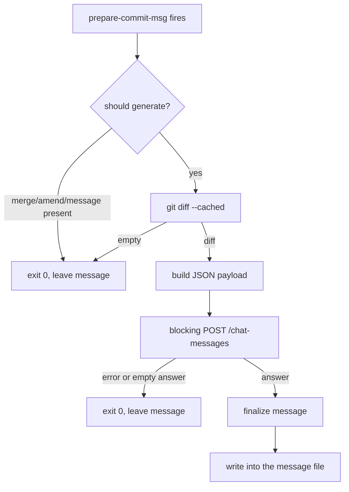

# commit-sense-via-dify CONTEXT

Last updated: 2026-07-28

Descriptive knowledge of what this project is and how it is meant to work. For
behavioral rules and commands, see [AGENTS.md](AGENTS.md).

## Purpose

A Dify app that generates commit messages intelligently from a diff already
exists. What is missing is the mechanism that connects it to actual Git usage:
every commit needs to call the Dify app automatically, so the intelligence
already built into the app is applied without the developer having to
remember or trigger it by hand.

## Design Status

Implementation is complete. All components are functional.

| Decision | State |
| --- | --- |
| Dify app, endpoint, and reply mode | confirmed |
| implementation language: Bash | confirmed |
| `prepare-commit-msg` as the hook stage | confirmed |
| single script carrying both modes | confirmed |
| leading-dash mode dispatch | confirmed |
| `bin/` placement | dropped — one file needs no directory |
| `jq` as a dependency | confirmed — required; see [JSON Handling](#json-handling) |

## Dify Backend

The backend is the **Kaye_Commit_Sense** app, a **Chatflow** (`advanced-chat`
mode), reached through the Dify Service API.

| Item | Value |
| --- | --- |
| Base URL | `http://43.153.9.47/v1` |
| Endpoint | `POST /chat-messages` |
| Authentication | `Authorization: Bearer {API_KEY}` |
| Request | `query` carries the staged diff, `inputs` is `{}`, `user` identifies the author |
| Reply mode | `blocking` — non-streaming, one JSON object |
| Result field | `.answer` |

Blocking mode was chosen deliberately over streaming. The Dify documentation
warns that a blocking request may be cut off after 100 seconds, so the
request carries a timeout; if the call fails or returns an empty answer, the
hook simply skips writing a message rather than emitting an empty one.

`curl`'s own `--max-time` bounds the network leg. When the `timeout` binary
is available (GNU coreutils; not guaranteed on stock macOS), both Dify calls
run under it as an extra wall-clock backstop of `KCSH_REQUEST_TIMEOUT_SEC + 5`
seconds, in case curl itself ever fails to honor `--max-time`. It is probed
once at load time and simply skipped when absent — degrade, don't require. A
sub-2-second response is only realistic for the no-op paths (empty diff, a
skip source, a missing dependency); an actual Dify call is bounded by
`KCSH_REQUEST_TIMEOUT_SEC`, not by that figure.

Configuration arrives through the environment, every name prefixed `KCSH_`:
`KCSH_DIFY_SERVICE_API_ENDPOINT` and `KCSH_DIFY_SERVICE_API_SECRET_KEY` are
required; `KCSH_REQUEST_TIMEOUT_SEC` (default `45`) and
`KCSH_DISABLE_MD_SYNTAX` (default `False`, forwarded to the request as
`inputs.disable_md_syntax`) are optional. The user identifier is hardcoded to
`"user"`. No credential is stored in the repository.

## Components

The project ships as one file, `kaye-commit-sense-hook.sh`, carrying both the
hook entry and the preflight checker. A two-script split was considered —
a generator plus a separate `verify-kaye-commit-sense-hook.sh` — but rejected:
the two would share roughly 80% of their code (`resolve_config`,
`check_dependencies`, the transport, the `stderr` reporting), and the split's
only structural benefit — a verifier that cannot physically write a message —
is obtainable behaviorally instead, at far lower cost than the split's
liabilities:

- the checker would need to `source` the generator, which demands a
  sourced-versus-executed guard around `main`; any top-level statement above
  that guard misfires silently when sourced
- a hook is typically installed as a copy or a symlink into
  `.git/hooks/prepare-commit-msg`, which relocates the generator away from its
  sibling and breaks a same-directory lookup
- installation is this project's core promise — fetch one file, mark it
  executable, symlink it into the hook path — and a two-file placement ritual
  undermines exactly that

### Argument Dispatch

One rule separates hook usage from preflight usage: **if the first argument
begins with `-`, it selects a mode; otherwise the full argument list is Git's
positional contract**, since Git never passes a message-file path starting
with `-`.

| First argument | Mode | Behavior |
| --- | --- | --- |
| absent | usage | print the synopsis to `stderr`, exit `2` |
| `--verify` | preflight | check dependencies, hook installation, configuration, call `GET /info`, confirm `advanced-chat` |
| `-h`, `--help` | help | print the synopsis to `stdout`, exit `0` |
| `--version` | version | print the version string, exit `0` |
| `--` | hook, explicit | shift once, treat the rest as Git's `$1`/`$2`/`$3` |
| any other `-`-prefixed token | error | unknown mode, exit `2` |
| any other token | hook, implicit | Git's `$1`/`$2`/`$3` contract applies |

`--verify` never resolves a message-file path, so the write path is
unreachable from that branch — the same guarantee the two-script split would
have given structurally, recovered here by construction. A bare invocation
with zero arguments must not attempt to generate, since there is no message
file to write to.

Considered and rejected: subcommands (`generate`/`verify`), which would break
direct symlinking into the hook path; a mode environment variable, which
conflates behavior selection with the settings channel already used by
`DIFY_API_KEY` and its siblings; and an inverted default where verify is
implicit and the hook path is the special case, which does not match actual
usage frequency.

## Data Flow

Feedback during the blocking call is `kamilog` logging on `stderr`, so the
message file stays the sole product of the run. `generate_message` wraps the
blocking Dify call with `start_generating_throb`/`stop_generating_throb`:
`kamilog` opens a "generating commit message" line with `-N` (leaving it
open, called once, never per frame) and the `throb-widget.sh` module
animates a single pulsing character in place on that line until the call
returns, then erases it and closes the line with a newline. Both halves are
`stderr`-only and silent when `stderr` is not a terminal.

`throb-widget.sh` v1.0.0 is a standalone, dependency-free module inlined at
the top of the script (q.v.
[kami-lel/throb-widget](https://github.com/kami-lel/throb-widget)) rather
than sourced from a separate file, in keeping with the one-file installation
promise. It backgrounds a subshell loop tied to the caller's PID (so it
exits on its own if the caller dies without calling `throb_widget_stop`),
chains onto any existing `EXIT`/`INT`/`TERM` trap rather than replacing it,
and picks a Unicode (`░▒▓█▓▒`) or ASCII (`.oO@Oo`) frame set by locale
detection, overridable via `throb_widget_start -u`/`-U`.

## Hook Stage

`prepare-commit-msg` is the correct stage, by Git's own design — it fires after
the default message is prepared and before the editor opens, and it is the only
stage that both receives the message file and still allows the developer to
review the result.

- `pre-commit` receives no arguments, so there is no message file to write
- `commit-msg` fires after the developer has edited, so writing there destroys their text
- `post-commit` would require rewriting the commit

Two consequences shape the script. `git commit --no-verify` bypasses
`pre-commit` and `commit-msg` but **not** `prepare-commit-msg`, so the generator
needs its own opt-out through an environment variable. The `$2` source argument
must be checked so that `-m`, merges, squashes, and amends are never
overwritten.

## Arguments

The generator takes Git's `prepare-commit-msg` arguments, positionally. The
caller supplies them; the script never synthesizes them itself.

| Position | Name | Meaning |
| --- | --- | --- |
| `$1` | message file | path to the file holding the commit message; the script writes its result here |
| `$2` | source | how the message originated, may be absent |
| `$3` | commit reference | the commit being reused, present only for `-c`, `-C`, and `--amend` |

`$2` governs whether the script runs at all:

| Value | Behavior |
| --- | --- |
| absent or `template` | generate — the intended case |
| `message` | skip — a message came from `-m` or `-F` |
| `merge` | skip — Git supplied a merge message |
| `squash` | skip — Git supplied a squash message |
| `commit` | skip — an existing commit is being reused |

`template` is deliberately **not** a skip case: `write_message_file` prepends
above whatever is already in the message file, so a configured
`commit.template` survives untouched below the generated subject line, the
same way Git's own trailing comment block does.

## JSON Handling

Building the request body and parsing the reply both require correct JSON
handling — the diff and the reply text can contain quotes, backslashes, and
newlines that break naive string handling. This was originally hand-rolled in
pure Bash to avoid a `jq` dependency, but a hand-rolled UTF-16 surrogate-pair
decoder (needed because Dify's backend defaults to Flask's `ensure_ascii=True`
and escapes non-ASCII output as `\uXXXX`, confirmed via
[langgenius/dify#8056](https://github.com/langgenius/dify/issues/8056), closed
as not-planned) surfaced a real arithmetic bug during implementation — the
kind of correctness risk a hand-written JSON layer keeps producing. `jq` is a
battle-tested JSON parser that eliminates this entire bug class, so the
dependency decision is reversed: **`jq` is now required.**

- request-body encoding: `jq -n --arg query "${diff}" --arg user "${DIFY_USER}" '{query:$query, inputs:{}, response_mode:"blocking", user:$user, auto_generate_name:false}'`
  builds the payload, so the diff never needs manual escaping
- reply parsing: `jq -r '.answer'` extracts the result field directly from the
  blocking response, correctly handling escaped quotes, embedded newlines, and
  `\uXXXX` sequences (including surrogate pairs for emoji) without any
  hand-written decoder
- a non-2xx HTTP status is checked before parsing, so an error body (which
  carries `code`/`message`, not `answer`) is never fed to the extractor

## Requirements

| Command | Why |
| --- | --- |
| `bash` | the implementation language itself |
| `git` | the hook context, and the source of `git diff --cached` |
| `curl` | the transport for `POST /chat-messages` |
| `jq` | builds the request body and parses the reply; see [JSON Handling](#json-handling) |

`--verify` checks this exact set, plus configuration, so an end user has one
command to confirm the environment is ready before relying on the hook.

Each of `git`/`curl`/`jq` is resolved to an absolute path by
`resolve_dependency`: `command -v` first, then a fixed fallback directory
search (`/usr/bin`, `/usr/local/bin`, `/opt/homebrew/bin`, `/bin`), covering
the minimal `PATH` a GUI-launched editor process can hand a hook. The
resolved paths land in `GIT_BIN`/`CURL_BIN`/`JQ_BIN`, which default to the
bare command names — sourcing the script without running
`check_dependencies` first (as the `examples/` demo scripts do) still
resolves through `PATH` normally. `--verify`'s expanded `check_hook_installation`
stage additionally reports the resolved `bash` interpreter, these three
paths, the active hooks directory (`git rev-parse --git-path hooks`, which
honors `core.hooksPath`), and whether `prepare-commit-msg` and
`kaye-commit-sense-hook.sh` are both present and executable there —
advisory only, since `--verify` may reasonably run before installation.

## Dogfooding in This Repository

This repository manages its own Git hooks through a separate tool, **hupy**,
so `kaye-commit-sense-hook.sh` never ran against a commit made in its own
repository — `.git/hooks/prepare-commit-msg` here only ever invoked hupy's
dispatcher. `.hupy.config.jsonc`'s `hb.prepare_commit_msg.lead` now wires
`./kaye-commit-sense-hook.sh` in ahead of hupy's own core logic; hupy
forwards the raw `$1`/`$2`/`$3` hook arguments to lead commands, so no
argument-passing shim was needed. This only wires the mechanism — the
`KCSH_DIFY_SERVICE_API_ENDPOINT`/`KCSH_DIFY_SERVICE_API_SECRET_KEY`
environment variables still need to be set in a developer's shell for it to
do anything beyond a clean skip.

## Implementation Complete

All components are now implemented:

- **`--verify` preflight** ✓ — checks dependencies, hook installation,
  resolves configuration, calls `GET /info`, and confirms the app mode is
  `advanced-chat`. Logs the resolved API endpoint, request timeout, and
  Markdown-syntax setting, then reports each check on stderr and exits
  non-zero on first failure — the sole command in this script allowed to.
- **hook gate** ✓ — skips generation when `KCSH_ENABLE_SKIPPING` is set, when
  `$2` indicates reuse (message/merge/squash/commit), or when the staged diff
  is empty.
- **generation and message write** ✓ — captures staged diff, logs progress on
  stderr via `kamilog` during the blocking call, prepends the answer above
  the existing message via atomic temp-file-and-mv beside the target file.
  Fails open on any error — `run_hook` always exits `0`, logging the reason
  to stderr and leaving the message file untouched; never writes an empty
  message.
- **environment variables** — every name is prefixed `KCSH_`:
  `KCSH_DIFY_SERVICE_API_ENDPOINT` and `KCSH_DIFY_SERVICE_API_SECRET_KEY` are
  required; `KCSH_REQUEST_TIMEOUT_SEC` (default `45`) and
  `KCSH_DISABLE_MD_SYNTAX` (default `False`) are optional. The user
  identifier is hardcoded to `"user"` and not configurable.
- **stage split** ✓ — `run_hook` reduced to orchestration over
  `is_generation_allowed`, `read_staged_diff`, `generate_message`, and
  `write_message_file`.
- **per-module logging** ✓ — each script section owns its own `kamilog`
  logger name (`LOGGER_ROOT="KCSH"`, `KCSH.dify`, `KCSH.git`) in place of one
  flat logger name.

## Runtime Expectations

- the working directory is the repository root, so relative paths resolve there
- the environment supplies `KCSH_DIFY_SERVICE_API_ENDPOINT` and
  `KCSH_DIFY_SERVICE_API_SECRET_KEY`; the user identifier is hardcoded as `"user"`
- `KCSH_ENABLE_SKIPPING` (any non-empty value) short-circuits the run, since
  `--no-verify` does not affect `prepare-commit-msg`
- `KCSH_REQUEST_TIMEOUT_SEC` and `KCSH_DISABLE_MD_SYNTAX` fall back to `45`
  and `False` respectively when unset
- the run is non-interactive — feedback goes to `stderr`, never `stdout`
- the hook path (`run_hook`) always exits `0`, even on internal failure — a
  broken generator must never block a commit. `--verify` is the sole command
  that exits non-zero, since it is a manual preflight with no commit at risk
