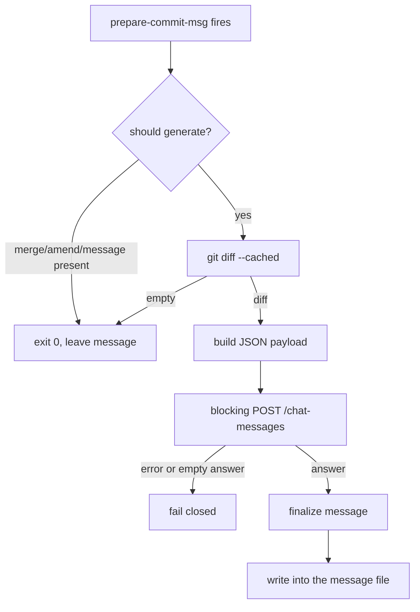

# commit-sense-via-dify CONTEXT

Last updated: 2026-07-26

Descriptive knowledge of what this project is and how it is meant to work. For
behavioral rules and commands, see [AGENTS.md](AGENTS.md).

## Purpose

A Dify app that generates commit messages intelligently from a diff already
exists. What is missing is the mechanism that connects it to actual Git usage:
every commit needs to call the Dify app automatically, so the intelligence
already built into the app is applied without the developer having to
remember or trigger it by hand.

## Design Status

Implementation is complete. All components are functional and tested.

| Decision | State |
| --- | --- |
| Dify app, endpoint, and reply mode | confirmed |
| implementation language: Bash | confirmed |
| `prepare-commit-msg` as the hook stage | confirmed |
| single script carrying both modes | confirmed |
| leading-dash mode dispatch | confirmed |
| `bin/` placement | dropped — one file needs no directory |
| `jq` as a dependency | confirmed — required; see [JSON Handling](#json-handling) |

## Dify Backend

The backend is the **Kaye_Commit_Sense** app, a **Chatflow** (`advanced-chat`
mode), reached through the Dify Service API.

| Item | Value |
| --- | --- |
| Base URL | `http://43.153.9.47/v1` |
| Endpoint | `POST /chat-messages` |
| Authentication | `Authorization: Bearer {API_KEY}` |
| Request | `query` carries the staged diff, `inputs` is `{}`, `user` identifies the author |
| Reply mode | `blocking` — non-streaming, one JSON object |
| Result field | `.answer` |

Blocking mode was chosen deliberately over streaming. The Dify documentation
warns that a blocking request may be cut off after 100 seconds, so the request
carries a timeout and the script fails closed rather than emitting an empty
message.

Configuration arrives through the environment: `DIFY_API_KEY`,
`DIFY_BASE_URL`, and `DIFY_USER`. No credential is stored in the repository.

## Components

The project ships as one file, `kaye-commit-sense-hook.sh`, carrying both the
hook entry and the preflight checker. A two-script split was considered —
a generator plus a separate `verify-kaye-commit-sense-hook.sh` — but rejected:
the two would share roughly 80% of their code (`resolve_config`,
`check_dependencies`, the transport, the `stderr` reporting), and the split's
only structural benefit — a verifier that cannot physically write a message —
is obtainable behaviorally instead, at far lower cost than the split's
liabilities:

- the checker would need to `source` the generator, which demands a
  sourced-versus-executed guard around `main`; any top-level statement above
  that guard misfires silently when sourced
- a hook is typically installed as a copy or a symlink into
  `.git/hooks/prepare-commit-msg`, which relocates the generator away from its
  sibling and breaks a same-directory lookup
- installation is this project's core promise — fetch one file, mark it
  executable, symlink it into the hook path — and a two-file placement ritual
  undermines exactly that

### Argument Dispatch

One rule separates hook usage from preflight usage: **if the first argument
begins with `-`, it selects a mode; otherwise the full argument list is Git's
positional contract**, since Git never passes a message-file path starting
with `-`.

| First argument | Mode | Behavior |
| --- | --- | --- |
| absent | usage | print the synopsis to `stderr`, exit `2` |
| `--verify` | preflight | check dependencies and configuration, call `GET /info`, confirm `advanced-chat` |
| `-h`, `--help` | help | print the synopsis to `stdout`, exit `0` |
| `--version` | version | print the version string, exit `0` |
| `--` | hook, explicit | shift once, treat the rest as Git's `$1`/`$2`/`$3` |
| any other `-`-prefixed token | error | unknown mode, exit `2` |
| any other token | hook, implicit | Git's `$1`/`$2`/`$3` contract applies |

`--verify` never resolves a message-file path, so the write path is
unreachable from that branch — the same guarantee the two-script split would
have given structurally, recovered here by construction. A bare invocation
with zero arguments must not attempt to generate, since there is no message
file to write to.

Considered and rejected: subcommands (`generate`/`verify`), which would break
direct symlinking into the hook path; a mode environment variable, which
conflates behavior selection with the settings channel already used by
`DIFY_API_KEY` and its siblings; and an inverted default where verify is
implicit and the hook path is the special case, which does not match actual
usage frequency.

## Planned: Stage Split and Fixture Example

Status: **planned, not implemented.**

`run_hook` currently welds five concerns into one function — the skip gates,
capturing `git diff --cached`, resolving configuration, calling Dify, and
rewriting the message file. Nothing in the script can turn *a diff already in
hand* into *a commit message on stdout*, so the fixtures under `tests/diffs/`
cannot be exercised end to end without staging them into a real repository.

The intended outcome is a runnable example that feeds
`tests/diffs/single-reorder.diff` through the real Dify backend and prints the
generated message to stdout. The example sources the script rather than adding
a command-line mode, since the sourced-versus-executed guard around `main`
already supports that and no new public interface is wanted.

### Stages

`run_hook` splits into four functions, behavior unchanged, with `run_hook`
reduced to orchestration over them:

| Stage | Responsibility |
| --- | --- |
| `is_generation_allowed SOURCE` | the `COMMIT_SENSE_SKIP` check and the `message`/`merge`/`squash`/`commit` case; `0` means proceed |
| `read_staged_diff` | wraps `git diff --cached`, prints the diff on stdout |
| `generate_message DIFF` | resolves configuration, draws the spinner, calls Dify, prints the message on stdout |
| `write_message_file ANSWER MSG_FILE` | the `mktemp` / prepend / `mv` sequence |

`generate_message` is the reusable seam — the one an example, a fixture run, or
a future batch driver can call without a staged index or a message file.
`resolve_config`, `call_dify_chat`, and `spinner` are reused untouched; the
split is pure extraction. The skip semantics the test suite asserts (exit `0`
on every skip path) must survive it.

### Steps

1. split `run_hook` into the four stages above — `kaye-commit-sense-hook.sh`
2. rebuild `run_hook` as orchestration over them, leaving `main` and the
   argument-dispatch table untouched — `kaye-commit-sense-hook.sh`
3. add `examples/single-reorder-demo.sh` — resolves the repository root from
   `BASH_SOURCE`, sources the hook script, reads the fixture, calls
   `generate_message`, prints the message on stdout, exits non-zero on failure
4. repoint `tests/test-commit-sense-via-dify.sh` at
   `../kaye-commit-sense-hook.sh`; it still sources the pre-rename
   `commit-sense-via-dify.sh` and therefore cannot run at all
5. note the example in `README.md` and record the change under `[Unreleased]`
   in `CHANGELOG.md`

### Verification

- `shellcheck kaye-commit-sense-hook.sh examples/single-reorder-demo.sh`
- `bash tests/test-commit-sense-via-dify.sh` — passes once Step 4 lands
- with credentials exported, `./examples/single-reorder-demo.sh` prints a
  commit message on stdout and exits `0`; without them it fails non-zero with
  a readable error and prints nothing on stdout
- `COMMIT_SENSE_SKIP=1 git commit` still short-circuits

The example requires `KCC_DIFY_API_SECRET_KEY` and
`KCC_DIFY_SERVICE_API_ENDPOINT`, since it performs a real Dify call.

## Data Flow

Feedback during the blocking call is a spinner drawn on `stderr`, so the
message file stays the sole product of the run.

## Hook Stage

`prepare-commit-msg` is the correct stage, by Git's own design — it fires after
the default message is prepared and before the editor opens, and it is the only
stage that both receives the message file and still allows the developer to
review the result.

- `pre-commit` receives no arguments, so there is no message file to write
- `commit-msg` fires after the developer has edited, so writing there destroys their text
- `post-commit` would require rewriting the commit

Two consequences shape the script. `git commit --no-verify` bypasses
`pre-commit` and `commit-msg` but **not** `prepare-commit-msg`, so the generator
needs its own opt-out through an environment variable. The `$2` source argument
must be checked so that `-m`, merges, squashes, and amends are never
overwritten.

## Arguments

The generator takes Git's `prepare-commit-msg` arguments, positionally. The
caller supplies them; the script never synthesizes them itself.

| Position | Name | Meaning |
| --- | --- | --- |
| `$1` | message file | path to the file holding the commit message; the script writes its result here |
| `$2` | source | how the message originated, may be absent |
| `$3` | commit reference | the commit being reused, present only for `-c`, `-C`, and `--amend` |

`$2` governs whether the script runs at all:

| Value | Behavior |
| --- | --- |
| absent or `template` | generate — the intended case |
| `message` | skip — a message came from `-m` or `-F` |
| `merge` | skip — Git supplied a merge message |
| `squash` | skip — Git supplied a squash message |
| `commit` | skip — an existing commit is being reused |

## JSON Handling

Building the request body and parsing the reply both require correct JSON
handling — the diff and the reply text can contain quotes, backslashes, and
newlines that break naive string handling. This was originally hand-rolled in
pure Bash to avoid a `jq` dependency, but a hand-rolled UTF-16 surrogate-pair
decoder (needed because Dify's backend defaults to Flask's `ensure_ascii=True`
and escapes non-ASCII output as `\uXXXX`, confirmed via
[langgenius/dify#8056](https://github.com/langgenius/dify/issues/8056), closed
as not-planned) surfaced a real arithmetic bug during implementation — the
kind of correctness risk a hand-written JSON layer keeps producing. `jq` is a
battle-tested JSON parser that eliminates this entire bug class, so the
dependency decision is reversed: **`jq` is now required.**

- request-body encoding: `jq -n --arg query "${diff}" --arg user "${DIFY_USER}" '{query:$query, inputs:{}, response_mode:"blocking", user:$user, auto_generate_name:false}'`
  builds the payload, so the diff never needs manual escaping
- reply parsing: `jq -r '.answer'` extracts the result field directly from the
  blocking response, correctly handling escaped quotes, embedded newlines, and
  `\uXXXX` sequences (including surrogate pairs for emoji) without any
  hand-written decoder
- a non-2xx HTTP status is checked before parsing, so an error body (which
  carries `code`/`message`, not `answer`) is never fed to the extractor

## Requirements

| Command | Why |
| --- | --- |
| `bash` | the implementation language itself |
| `git` | the hook context, and the source of `git diff --cached` |
| `curl` | the transport for `POST /chat-messages` |
| `jq` | builds the request body and parses the reply; see [JSON Handling](#json-handling) |

`--verify` checks this exact set, plus configuration, so an end user has one
command to confirm the environment is ready before relying on the hook.

## Implementation Complete

All components are now implemented and tested:

- **`--verify` preflight** ✓ — checks dependencies, resolves configuration,
  calls `GET /info`, and confirms the app mode is `advanced-chat`. Reports
  each check on stderr and exits non-zero on first failure.
- **hook gate** ✓ — skips generation when `COMMIT_SENSE_SKIP` is set, when
  `$2` indicates reuse (message/merge/squash/commit), or when the staged diff
  is empty. Test suite covers all skip conditions.
- **generation and message write** ✓ — captures staged diff, shows stderr
  spinner during the blocking call (managed via trap on all exit paths),
  prepends the answer above existing message via atomic temp-file-and-mv.
  Fails closed on any error; never writes an empty message.
- **environment variables** — updated to use `KCC_DIFY_API_SECRET_KEY` and
  `KCC_DIFY_SERVICE_API_ENDPOINT`; the user identifier is hardcoded to
  `"user"` and no longer configurable via environment.

## Runtime Expectations

- the working directory is the repository root, so relative paths resolve there
- the environment supplies `KCC_DIFY_API_SECRET_KEY` and
  `KCC_DIFY_SERVICE_API_ENDPOINT`; the user identifier is hardcoded as `"user"`
- `COMMIT_SENSE_SKIP` (any non-empty value) short-circuits the run, since
  `--no-verify` does not affect `prepare-commit-msg`
- the run is non-interactive — feedback goes to `stderr`, never `stdout`
- the exit code is `0` on success or a deliberate skip, non-zero on failure, so
  the caller decides whether a Dify outage blocks the commit
