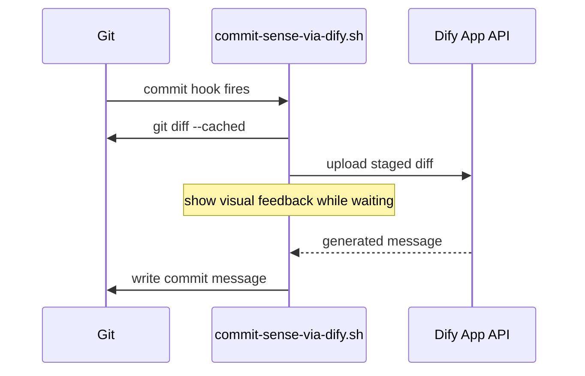

# commit-sense-via-dify CONTEXT

Last updated: 2026-07-24

Descriptive knowledge of what this project is and how it is meant to work. For
behavioral rules and commands, see [AGENTS.md](AGENTS.md).

## Purpose

Generate a Git commit message automatically from the staged changes by
delegating the writing to a Dify application. The project is intended to run
during `git commit`, so the developer commits and receives a coherent message
without composing it by hand.

## Design Status

The single deliverable, `commit-sense-via-dify.sh`, is not yet implemented. This
document describes the intended architecture so that the implementation and its
documentation stay aligned.

## Data Flow

- **capture** — the script runs `git diff --cached` to read the staged diff
- **upload** — the diff is sent to the configured Dify app over HTTP
- **wait** — the script blocks on the response, showing progress to the user
- **write** — the returned text is written back as the commit message

## Integration Point

The script is meant to be wired into the Git commit lifecycle as a hook, so it
executes automatically on every commit. The hook supplies the message before the
editor opens, or replaces the default message outright.

## External Dependency

The project relies on a Dify application as its message-generation backend.
Authentication and endpoint details are supplied through the environment at run
time, keeping secrets out of the repository.

## Components

| Component | Responsibility |
| --- | --- |
| `commit-sense-via-dify.sh` | capture diff, call Dify, render feedback, emit message |
| Git hook | triggers the script during commit |
| Dify app | turns a staged diff into a commit message |
